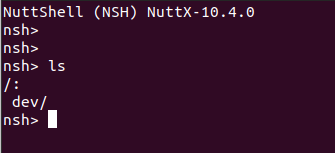

Ref:
  1. https://nuttx.apache.org/docs/latest/guides/cpp_cmake.html
  2. https://github.com/apache/incubator-nuttx/issues/5530

Build:
  1. How to build Nutxx

    $ cd nuttx/nuttx

    $ ./tools/configure.sh -l nucleo-h743zi2:nsh

    $ make export

    $ cd ../..;tar -zxvf nuttx/nuttx/nuttx-export-10.4.0.tar.gz -C .

  2. How to build apps

    $ cmake -B build -DCMAKE_EXPORT_COMPILE_COMMANDS=true;cmake --build build

  3. How to update firmware

    $ st-flash write ./build/fmu_nuttx.bin 0x8000000

  4. Testing with nsh

    $ reset MCU
    
    $ screen /dev/ttyACM0 115200 8N1

    
